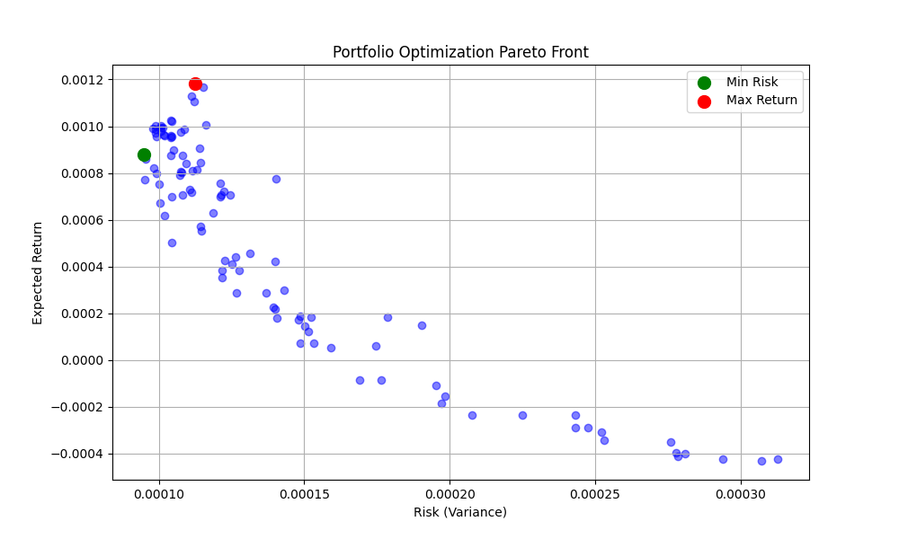
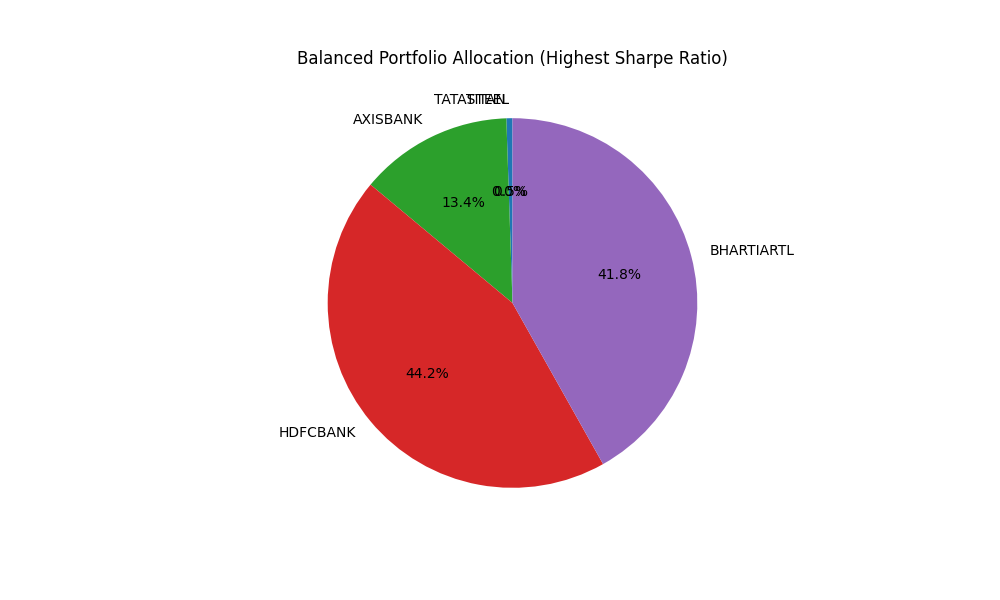

# AI Optimization Projects

This repository contains two AI-based optimization projects demonstrating evolutionary algorithms for real-world applications.

---

## Project 1: Portfolio Optimization using NSGA-II

Multi-objective portfolio optimization using the Non-dominated Sorting Genetic Algorithm II (NSGA-II) to find optimal asset allocations balancing risk and return.

### Overview

This project applies Pareto optimization principles to simultaneously:
- **Maximize expected returns**
- **Minimize portfolio risk** (measured by variance)

The portfolio comprises five stocks from India's Nifty 50 index using historical data from April 17, 2024 to April 17, 2025.

### Stocks Analyzed

| Stock | Sector |
|-------|--------|
| TATASTEEL | Metals |
| TITAN | Consumer Goods |
| AXISBANK | Banking |
| HDFCBANK | Banking |
| BHARTIARTL | Telecom |

### Results

#### Pareto Front
The Pareto front shows the trade-off between risk and return. Each point represents an optimal portfolio where improving one objective degrades the other.



#### Balanced Portfolio Allocation
The balanced portfolio maximizes the Sharpe ratio, providing the best risk-adjusted returns.



### Key Portfolios Identified

1. **Minimum Risk Portfolio** - Lowest volatility, conservative allocation
2. **Maximum Return Portfolio** - Highest expected returns, aggressive allocation
3. **Balanced Portfolio** - Highest Sharpe ratio, optimal risk-adjusted returns

### How to Run

```bash
# Install dependencies
pip install numpy pandas matplotlib deap

# Run the optimization
python nsga_ii_portfolio_final.py
```

### Files

| File | Description |
|------|-------------|
| `nsga_ii_portfolio_final.py` | Main implementation |
| `nsga_ii_portfolio.py` | Basic implementation |
| `NSGA_II_FinancialReport.md` | Detailed methodology |
| `Portfolio_Optimization_NSGA_II.md` | Theory documentation |

---

## Project 2: Green Hydrogen Production Optimization using Differential Evolution

Optimization of electrolyser size for green hydrogen production coupled with offshore wind farms using the Differential Evolution (DE) algorithm.

### Overview

Based on the study by Dinh et al. (2025), this project demonstrates DE's application in minimizing the Levelised Cost of Hydrogen (LCOH₂) for offshore wind-powered electrolysis systems.

### Problem Statement

Optimize electrolyser capacity relative to a 600 MW offshore wind farm (OWF) to minimize hydrogen production costs while considering:
- Variable wind speeds affecting energy availability
- Capital costs (equipment, infrastructure)
- Hydrogen production efficiency
- Offshore vs. onshore configuration trade-offs

### Differential Evolution Algorithm

The DE algorithm iteratively optimizes electrolyser capacity through:

1. **Initialization** - Generate population of candidate capacities
2. **Mutation** - Create mutant vectors: `v = x_r1 + F × (x_r2 - x_r3)`
3. **Crossover** - Combine mutant with parent using crossover probability
4. **Selection** - Retain solution with lower LCOH₂
5. **Iteration** - Repeat until convergence

### Mathematical Models

**Wind Speed Distribution (Weibull):**
```
f_w(k,C) = (k/C) × (v/C)^(k-1) × e^(-(v/C)^k)
```

**Levelised Cost of Hydrogen:**
```
LCOH₂ = Total Discounted Costs / Total Hydrogen Production
```

### Key Results

| Configuration | Optimal Capacity | LCOH₂ | H₂ Production |
|--------------|------------------|-------|---------------|
| Offshore-EL | 91.41% (548.46 MW) | €3.79/kg | 57.55 kt/year |
| Onshore-EL | 94.54% (567.24 MW) | €4.29/kg | 55.5 kt/year |

### Why DE Over Other Methods?

- Handles non-linear, non-differentiable objective functions
- Avoids local optima through population diversity
- Efficient for multi-parameter optimization problems

---

## Requirements

```bash
pip install numpy pandas matplotlib deap
```

## Project Structure

```
AI_proj/
├── nsga_ii_portfolio_final.py    # NSGA-II implementation
├── nsga_ii_portfolio.py          # Basic NSGA-II
├── nsga_ii_portfolio_fix.py      # Fixed version
├── NSGA_II_FinancialReport.md    # Financial report
├── Portfolio_Optimization_NSGA_II.md  # Theory doc
├── AIDA2_merged.pdf              # DE research paper
├── pareto_front.png              # Pareto front visualization
├── balanced_portfolio_pie.png    # Portfolio allocation chart
└── Quote-Equity-*.csv            # Stock data files
```


## References

1. Markowitz, H. (1952). Portfolio Selection. The Journal of Finance.
2. Deb, K., et al. (2002). A Fast and Elitist Multiobjective Genetic Algorithm: NSGA-II.
3. Dinh, et al. (2025). Optimizing Electrolyser Size for Green Hydrogen Production Using Differential Evolution. International Journal of Hydrogen Energy.

## License

This project is provided for educational purposes only.
